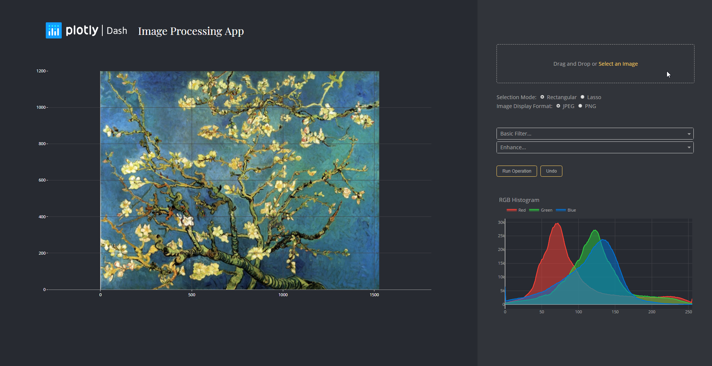

# Proyecto DPI 





### Instalación

Correr la aplicación

```
pip install -r requirements.txt

```

```
python app.py

## Built With
* [Dash](https://dash.plot.ly/) - Main server and interactive components
* [Plotly Python](https://plot.ly/python/) - Used to create the interactive plots
* [Pillow](http://scikit-learn.org/stable/documentation.html) - Apply operations to images
* [Boto S3](http://boto.cloudhackers.com/en/latest/ref/s3.html) - Store User inputted images
* [Redis](https://redis.io/documentation) - Cache the user input

